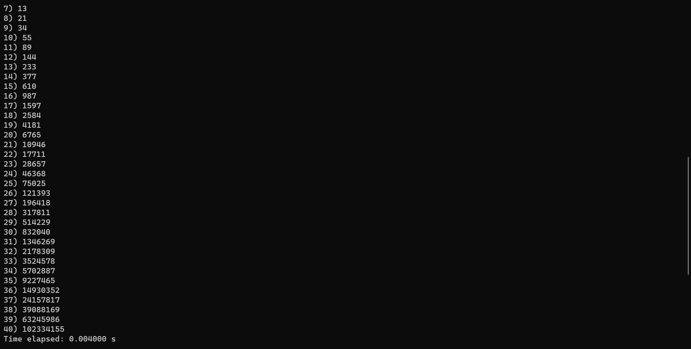
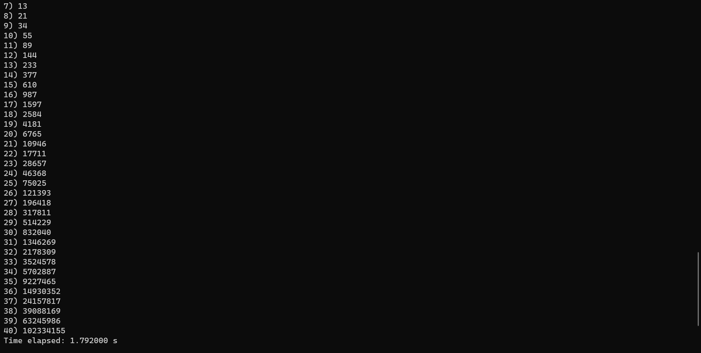

# fibonacci-benchmark

1. To compile the library, run:
  ```sh
    gcc -c mylib/mylib.c -o mylib.o
  ```
 
 
 
2. After that, to compile the main test code, run:
  ```sh
    gcc -c main_test.c -o main.o
  ```
  
Alternatively, to compile the benchmark files, run:
   
  ```sh
      gcc -c main_b_time_iterative.c -o main.o
  ```   
or
   
  ```sh
      gcc -c main_b_time_recursive.c -o main.o
  ```
or
   
  ```sh
      gcc -c main_b_space_iterative.c -o main.o
  ```
or
   
  ```sh
      gcc -c main_b_space_recursive.c.c -o main.o
  ```

note: To benchmark the memory space taken, open task manager (windows) or system monitor (linux) after running the main.out file. Don't forget to terminate the program by pressing ctrl + c in the command line or just end task the program in task manager.


3. Finally, to compile the code to get the main.out (for linux), run:
  ```sh
       gcc -o main.out main.o mylib.o
  ```

   For windows, skip all the above steps and just run 
    ```
      run.bat
    ```
   after changing main_test in line 2 to the file you want to compile

# Documentation
Time comparison:

Iterative


Recursive


As shown in the two pictures, the iterative function takes much less time than the recursive function


